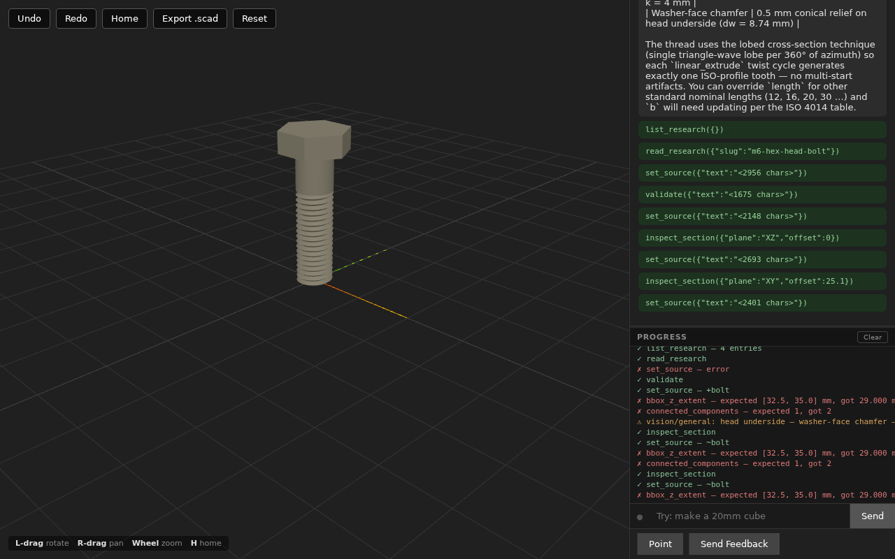
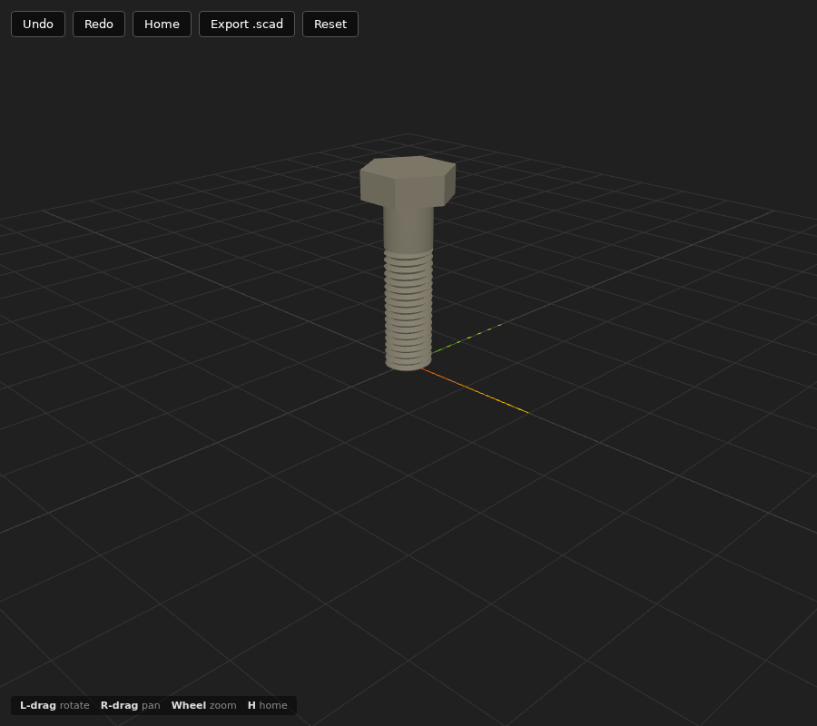
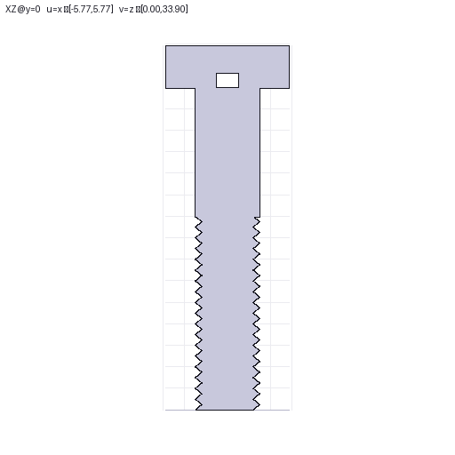

# fastcad

AI-driven incremental 3D modeler — OpenSCAD-compatible export, three.js
viewer, Anthropic Claude as the modeling agent. Local web app, runs on
Ubuntu/WSL with the browser on Windows.



## Quick start (WSL)

```
python3 -m venv .venv
.venv/bin/pip install -e ".[dev]"
.venv/bin/playwright install chromium      # only needed for e2e tests
bash scripts/fetch-vendor.sh                # downloads three.js, rrweb, html2canvas
export ANTHROPIC_API_KEY=sk-ant-...
bash scripts/dev.sh                         # http://localhost:8765/
```

Open `http://localhost:8765/` in your Windows browser. WSL2 forwards
localhost automatically. If Windows Defender Firewall blocks inbound TCP
on first run, allow port 8765.

## What it does

- Type a prompt: *"Make a 20mm cube"*, *"Design an M6 hex bolt 25 mm
  long"*, *"Create a Raspberry Pi 4B enclosure"*.
- The agent rewrites a single `.scad` spec each turn (the spec is the
  model, the export, and the source-of-truth — no separate IR). A
  dependency-aware cache re-meshes only the modules whose dependencies
  actually changed.
- Three feedback channels close the agent's 3D blind spot: a structural
  validator (Channel 1), parallel vision critics (Channel 2), and 2D
  cross-section inspection (sections + `inspect_section` tool).
- Cached research entries in `docs/research/` give the agent canonical
  spec data for standardized parts.
- Per-turn cost + elapsed footer on each agent reply.
- **Open .scad from disk.** Drop in any existing `.scad` (or one
  produced by another tool) via the **Open .scad** toolbar button.
  Pairs with the SCAD-conversation comment spec
  (`docs/specs/scad-conversation-comments.md`) so the agent emits
  design history inline as `fc-meta` / `fc-prompt` / `fc-decision`
  / `fc-note` comments — an opened file carries its own design
  conversation back into a future session.
- **Interactive section plane.** Toolbar buttons `Cut X` / `Cut Y` /
  `Cut Z` (hotkeys `1` / `2` / `3`, `0` to turn off) clip the scene
  with a draggable plane. Each cut solid is filled with a stencil-
  based cap in the axis tint so cross-sections read as solid
  CAD-style faces, not hollow shells.
- **Per-object colors.** Each top-level module renders in its own
  deterministic colour (HSL hash of the node id), so the parts of a
  multi-module model are distinguishable at a glance.
- Undo / Redo / Reset / Open .scad / Export .scad — round-trip with
  real OpenSCAD any time.

| Iso render (browser) | Axial section (validator's eye) |
|----------------------|----------------------------------|
|  |  |

The XZ section on the right is what the section critic feeds back to
the agent — paper-thin spike teeth show up unambiguously in 2D where
they hide in a 3D iso render. That's how this thread profile got
recovered after multiple iterations of the same agent producing
"helical band of zero thickness" geometry.

## Tests

```
.venv/bin/pytest tests/unit -q             # ~290 unit tests (kernel,
                                           # parser, evaluator, session, scad,
                                           # agent, ws, feedback, validate,
                                           # sections, security, open_scad, …)
bash scripts/e2e.sh                         # Playwright headless Chromium
.venv/bin/pytest tests/equivalence -q       # OpenSCAD-vs-fastcad equivalence
                                           # suite — fixture-driven; skips
                                           # if the openscad CLI isn't on PATH
```

E2E tests skip cleanly if Chromium isn't installed, so a fresh `pytest`
won't fail on a machine that hasn't run `playwright install` yet. The
equivalence suite skips the same way when OpenSCAD isn't installed.

## Reporting UI bugs

Click **Send Feedback** in the chat pane (toggle **Point** first to anchor
the report to a specific element). The bundle lands in
`tmp/feedback/<timestamp>/` containing:

- `description.txt` — your text
- `target.json` — selector + bounding rect of the pointed element
- `rrweb.json` — last ~60s of DOM/input events
- `dom.png` — `html2canvas` snapshot of the page
- `viewer.png` — three.js canvas snapshot
- `camera.json` — camera position + target
- `oplog.json` — server-side op log up to that moment
- `ws_log.json` — last 200 WebSocket messages

The Claude agent reads those files directly to debug — no need to attach
screenshots in chat.

## Offline / deterministic mode

`ANTHROPIC_FAKE=1` swaps the real Anthropic client for a regex-driven
fake that handles a small set of demo prompts deterministically. Used by
all e2e tests; useful for offline development.

## Architecture

See `docs/architecture.md` for the full system view (spec model, agent
loop, three feedback channels, wire protocol, security posture,
deployment) and `CLAUDE.md` for project-wide conventions. Per-feature
plans live in `docs/plans/`.

## Production deploy

`deploy/` ships everything for a hardened single-VM deployment:
`Caddyfile` (auto-LE TLS + basic_auth + rate-limit), sandboxed
systemd unit, fail2ban jail, and an idempotent `bootstrap.sh` for
a fresh Ubuntu 24.04 host. See `deploy/README.md` for the gcloud
provisioning sequence.

## License

[MIT](LICENSE) — © 2026 Adi Oltean.
